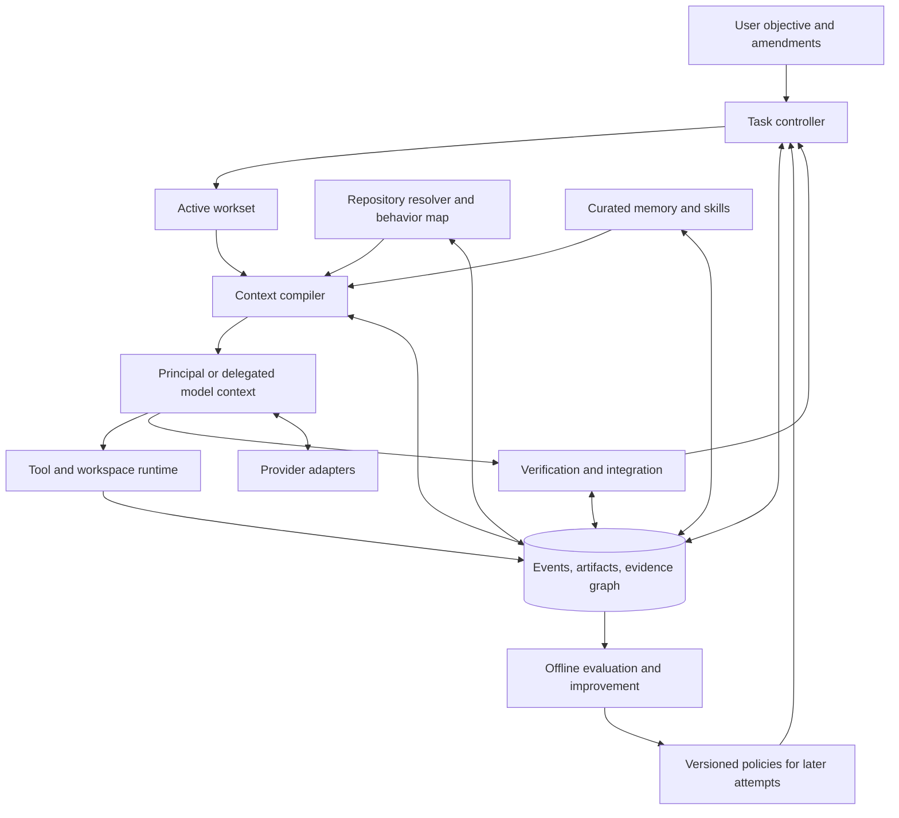

# SOTA Coding Agent: A Mid-Weight Architecture Proposal

**Status:** research-backed design draft, ready for implementation planning; no runtime or benchmark superiority is claimed.  
**Date:** 2026-09-19.  
**Primary design sources:** [judje-2.md](judje-2.md), [merged-best-harness-ideas.md](merged-best-harness-ideas.md), and [ideas-summary-mix.md](ideas-summary-mix.md).  
**Brief:** [GOAL.md](GOAL.md). This proposal follows its expanded scope over the earlier minimalist selection in the corpus.

**Reading paths:** [architecture and rationale](#1-recommended-architecture) → [contracts and evidence](#5-durable-contracts-and-the-evidence-model) → [context and execution](#7-context-compilation-and-token-economy) → [evaluation](#15-evaluation-program-and-falsifiable-gates) → [implementation roadmap](#16-implementation-roadmap-and-exit-criteria).

## 1. Recommended architecture

Build a **task-centered, evidence-guided coding runtime** with one durable controller, one principal coding context, and selectively activated specialist contexts. Its central resource is a versioned evidence store connecting requirements, repository behavior, source artifacts, decisions, and verification. A context compiler turns that store into a sufficient working set for the next decision. The same evidence supports change-impact analysis, recovery, review, and project memory.

The principal agent remains responsible for understanding the problem and producing coherent code. Ordinary software owns scheduling, accounting, artifact identity, process management, edit preconditions, and completion transitions. Models propose interpretations, plans, patches, experiments, and reviews. They cannot establish execution facts by assertion.

This is a full mid-weight target: repository navigation, durable multi-step work, structured context management, curated memory, independent review, bounded delegation, calibrated model selection, and an offline improvement pipeline are designed capabilities. A local fix exercises a small portion of them; a cross-package migration can exercise all of them. Conditional activation reduces operating cost without making those capabilities unspecified future work.

The most valuable synthesis is **shared evidence with separate authority**:

- Requirements say what must become true. They persist independently of plans and context windows.
- Repository observations say what was found at a particular version, with explicit coverage limits.
- Working contexts contain the evidence needed for a bounded decision, including unresolved dependencies.
- Check records say what actually ran against which candidate and environment.
- Memory carries reusable, scoped claims whose dependencies can become stale.
- The controller decides when the recorded evidence supports a permitted state transition. Semantic sufficiency still requires appropriate checks or review.

This design retains HELM's useful mechanics—guarded edits, bounded observations, explicit uncertainty, resumable state, and stamped checks—while replacing its minimalism constraints. It incorporates the merged dossier's packets, context compilation, knowledge layers, role/model separation, and integration discipline; and the survey's complementary retrieval, behavior maps, staged reduction, long-horizon recovery, and controlled improvement.

### 1.1 The target operating envelope

The intended workload is difficult maintenance and feature work in medium and large repositories: cross-module debugging, nontrivial algorithms, API/configuration migrations, multi-file refactoring, unfamiliar subsystem discovery, and tasks spanning interruptions or several context windows. Repository size matters mainly through dependency complexity, build cost, and localization difficulty; lines of code are an evaluation stratum, not an algorithmic switch.

The preferred deployment is a **modular local application**: one controller process, SQLite metadata, content-addressed artifact files, subprocess execution, and optional isolated worker workspaces. Native model APIs and external language/build tools are adapters. No graph server, distributed scheduler, mandatory vector database, or permanent agent organization is necessary.

| Capability | Required in the complete target | Activation policy |
| --- | --- | --- |
| Durable task contract, requirement ledger, events, action recovery | Yes | Every task, with a compact representation for small tasks |
| Guarded patching, process handles, bounded observations, evidence-bound checks | Yes | Every relevant action |
| Context compiler, selective rehydration, semantic checkpoints | Yes | Compile every invocation; checkpoint/reduce when useful or required |
| Behavior-to-code maps and a versioned evidence graph | Yes | Expand around active behavior and affected contracts |
| Scoped project memory and procedural skills | Yes | Retrieve and load on an actual information need |
| Independent review and artifact-based delegation | Yes | Consequential review, separable investigation, or stable module work |
| Model profiles and bounded escalation | Yes | Capable default; cheaper/specialist profiles only for calibrated strata |
| Offline diagnosis, candidate evaluation, promotion and rollback | Yes | Between frozen execution attempts |
| Dense retrieval, automatic harness mutation, speculative execution, training | Experimental | Only after a demonstrated bottleneck and a controlled comparison |

### 1.2 What makes the combination promising

The architecture addresses both sides of the objective through the same mechanisms. Complementary retrieval prevents missing a caller contract while avoiding redundant snippets. Artifact identity prevents stale edits and unnecessary repeat checks. A durable requirement ledger preserves autonomous progress while allowing old conversation to leave the window. Curated memory reduces repeated discovery without turning every earlier conclusion into an instruction. Delegation buys independent attention only where the result can be integrated economically.

These are hypotheses about a composed system, not additive performance claims. The principal research question is whether this combination improves difficult-task acceptance and total token consumption under matched budgets. Section 15 specifies how to find out.

## 2. Research basis and critical synthesis

### 2.1 How the supplied documents are used

| Source | Most valuable contribution | Required reinterpretation |
| --- | --- | --- |
| **J2:** [judje-2.md](judje-2.md), especially §§5–9 | Context residency; version-aware editing; explicit seen/unseen state; diagnostic feedback; executable acceptance | Three tools, a 1,500-token state, no model compaction, and a roughly 3,200-line estimate are minimalist design choices, not constraints on this project |
| **M:** [merged-best-harness-ideas.md](merged-best-harness-ideas.md), especially §§3–13, 15–18 | Context compiler; durable knowledge; packets and receipts; independent roles/models/topology; routing and integration | Avoid rigid role silos, universal high-tier reviews, unconditional contract injection, and automatic promotion of confidence scores into authority |
| **I:** [ideas-summary-mix.md](ideas-summary-mix.md), especially §§2–15, 18 | Complement-aware retrieval; behavior maps; staged context reduction; continuity; measured improvement | Research configurations and component scores need workload-specific validation; experimental machinery does not all belong in the default execution path |
| **J1, supporting critique:** [judje-1.md](judje-1.md), §§5.1–5.7 and 8.2–8.3 | Falsifiability, honest transaction semantics, scoped verification, recoverability, adversarial fixtures | Used to correct overclaims in J2, without reopening its minimalist competition as this project's objective |

The primary documents supply the design space. External research checks the most consequential mechanisms and operational assumptions. Their independent `Sxx` identifiers are deliberately not reused here. The accompanying [research notes](SOTA-RESEARCH-NOTES.md) record targeted primary-source checks; this document contains the architectural conclusions and their limits.

### 2.2 External evidence that changes the design

The following is a targeted investigation, not an independent replication or an exhaustive ranking of current systems. Linked papers establish their reported experiments; architectural choices below remain proposals.

| Primary source | Supported lesson | Limit and resulting decision |
| --- | --- | --- |
| [The Complexity Trap](https://arxiv.org/html/2508.21433v3) | Observation masking is a serious comparator to model summarization; hybrid policies deserve testing | Use deterministic aging first, with selective semantic compaction; reject a universal summary/no-summary rule |
| [SoL-Pi](https://arxiv.org/html/2609.20519v1) | Action fusion, observation handles, checked log receipts, and cost-aware compaction are concrete efficiency mechanisms | Its complete efficiency configuration and highest-score component configuration are different operating points; do not present their benefits as one quality-preserving result |
| [The Missing Complement](https://arxiv.org/html/2609.20050v1) | Evidence retrieval should seek missing relationships, not only similar units | Pool-based evidence coverage is different from gold-blind repository discovery or solved tasks; adopt the retrieval question, evaluate the complete solver |
| [Harness Handbook](https://arxiv.org/html/2607.13285v1) | Progressive behavior-to-code disclosure can improve localization and planning | Read-only plans do not prove repair success; maps assist discovery and never replace current source |
| [RepoAtlas](https://arxiv.org/html/2609.16936v1) | Task-specific structural views can support repository repair | A graph extracted from a fixed snapshot needs additional invalidation machinery for edited code; revision tracking here is an engineering addition |
| [Agentic Context Engineering, ACE](https://arxiv.org/html/2510.04618v3) | Itemized updates provide an alternative to repeatedly rewriting one memory summary | Its evaluated tasks do not certify this coding architecture; use evidence-backed records, supersession, and controlled memory experiments |
| [Towards a Science of Scaling Agent Systems](https://arxiv.org/html/2512.08296v3) | The effect of additional agents depends on task structure and coordination cost | Agent count is not a default optimization; measure independent work, result selection, and integration together |

Operational facts are checked separately. OpenAI documents that response-chain history remains billable input and that cache reuse depends on eligible matching prefixes. Those facts rule out treating a continuation ID or short network payload as context savings. [Conversation state](https://developers.openai.com/api/docs/guides/conversation-state), [prompt caching](https://developers.openai.com/api/docs/guides/prompt-caching).

### 2.3 Resolutions of incompatible recommendations

| Tension in the corpus | Decision for this architecture | Reason |
| --- | --- | --- |
| Small core versus full agent capability | Modular monolith with a complete capability set and inexpensive inactive paths | Limits operational complexity without deleting repository intelligence or adaptation |
| Fixed tiny STATE versus large objectives | Durable full contract plus bounded active projection | A prompt cap cannot determine the size of the user's objective |
| No LLM summaries versus routine summarization | Producer limits → deterministic receipts/aging → selective semantic checkpoint | Preserve cheap exact evidence; use semantic compression when it earns its cost |
| Every contract always visible versus role filtering | Global invariants plus affected contract closure; searchable catalog for the rest | Neither prompt saturation nor hidden adjacent interfaces is acceptable |
| Workers never decide versus autonomous implementation | Workers make local choices inside contracts; cross-boundary changes return to the owner | Eliminates a coordination bottleneck while preventing incompatible shared decisions |
| Silence means green versus delta-only feedback | Emit diagnostic deltas together with current absolute status and version | An unchanged failure must remain visibly failed |
| Whole-turn atomicity versus tools with side effects | Journaled patch batches and isolated candidates; commands have separate outcomes | File replacement, database transactions, and external commands are different effect domains |
| Mandatory seen-region edits versus large mechanical refactors | Observed-region patching by default; explicit, isolated transformation mode for audited codemods | A reliable transformation need not paste forty whole files into the prompt |
| Cheap-first routing versus quality | Calibrated eligibility and a quality floor before cost selection | An affordable profile that cannot meet the floor is not an eligible substitute |
| Role prestige versus memory retention | Retain by evidence value, uniqueness, relevance, and reconstruction cost | A rare test reproduction can matter more than an architecture conversation |
| Full suite after every few steps versus efficiency | Claim-matched checks, conservative invalidation, broader milestone checks | Fixed cadence is a tuning option, not evidence that the right behavior was checked |
| Every innovation must be preserved versus coherent design | Adopt, refine, defer, or reject explicitly | The objective is a valuable combination, not an inventory implementation |

## 3. Objective, workload, and success criteria

### 3.1 Quality is an eligibility constraint as well as a score

Adopt the survey's **60/40 preference** as a research-program starting point: 60% coding quality and complex-task completion, 40% token/context economy. These are ranking weights, not permission to discard 40% of requirements or fixed shares of a context window. The user brief requires balance; it does not establish a measured optimum for these numbers.

First satisfy correctness, scope, regression, and authorization constraints. Then compare eligible configurations on quality and efficiency. A cheaper system that repeatedly drops difficult requirements is ineligible regardless of aggregate score. A slower expensive run can be justified when it achieves a required result that cheaper configurations cannot.

Primary outcomes are complete task acceptance, complex-task acceptance, repeated-run reliability, and retained behavior. Maintainability is assessed through a fixed review rubric: coherent module boundaries, compatibility, reuse of existing mechanisms, comprehensibility, and unnecessary complexity. Test count, changed lines, tool count, and the agent's confidence are not quality measures.

### 3.2 Operational task classes

| Class | Representative difficulty | Expected execution shape |
| --- | --- | --- |
| Local correction | Clear behavior, small surface, strong existing tests | Principal context; direct tools and targeted verification |
| Cross-module defect | Failure far from cause, incomplete contracts, several plausible explanations | Behavior map, complementary retrieval, experiments, fresh review when needed |
| Architectural feature | New boundary or algorithm, interactions with existing subsystems | Explicit design alternatives, small contract decisions, staged implementation and integration |
| Broad refactor/migration | Many edits, compatibility obligations, transitional broken states | Migration plan, transformation mode, isolated candidate, staged and final checks |
| Long investigation | Several contexts, expensive builds, intermittent results | Checkpoints, process reconciliation, negative evidence, selective rehydration |
| Separable implementation | Stable interfaces and independently verifiable deliverables | Bounded workers, separate candidates, serial integration and combined checks |

Security controls support reliable work: scoped execution, preservation of user files, controlled credentials, and correct authority. They do not replace the architecture's central goal of producing good code efficiently.

### 3.3 Non-negotiable invariants

1. The full user objective and authorized amendments outlive any plan, attempt, provider session, or context reset.
2. A plan change cannot silently delete an acceptance obligation. Supersession records its source and reason.
3. Source identity, observed coverage, and semantic understanding remain distinct.
4. Tool status, hashes, usage, process outcomes, and capture limits are runtime facts, not model-authored fields.
5. Each check supports only its recorded candidate, environment, and actual scope.
6. Unknown execution outcomes are reconciled before potentially duplicating an effect.
7. Every mutation has an owner; integration has one authority per destination workspace.
8. Memory is fallible evidence. Retrieval relevance is separate from permission and instruction authority.
9. Context reduction cannot remove the only recoverable copy of required state or evidence without recording the loss.
10. All children, retries, compaction, routing, review, and verification consume the originating work's budget.
11. Completion is a supported state; budget exhaustion, cancellation, and waiting are distinct outcomes.
12. Experimental harness changes cannot modify the independent evaluation target or take effect invisibly during an attempt.

## 4. Components, ownership, and deployment



| Module | Sole ownership | Principal interface and failure behavior |
| --- | --- | --- |
| Task controller | Contract versions, requirement status, ready work, budgets, cancellation, finalization | `advance(event)`, `select_ready()`, `propose_completion()`; rejects unsupported transitions |
| Evidence store | Durable events, record versions, artifact references, dependency edges | `append()`, `resolve()`, `snapshot()`; unavailable store stops new consequential actions |
| Repository resolver | File/symbol lookup, maps, read coverage, index freshness | `locate()`, `read()`, `relations()`; reports scope and falls back to direct search |
| Context compiler | Selection, prompt rendering, manifests, projection lifetime | `compile(workset, profile)`; returns a context or a precise capacity/evidence gap |
| Worker runtime | Model/action loop within a work packet | `run(packet)`; emits proposals and observations, never unilaterally accepts itself |
| Tool/workspace runtime | Validated execution, guarded writes, processes, captured outputs, capability checks | `execute()`, `poll()`, `cancel()`, `reconcile()`; records partial and unknown outcomes |
| Verification/integration | Check plans, result parsing, candidate publication, requirement-evidence assessment | `verify()`, `integrate()`, `assess()`; returns pass/fail/inconclusive with coverage |
| Knowledge module | Memory admission, applicability, supersession, skill views | `retrieve()`, `propose_record()`, `admit()`; optional reuse can degrade to direct inspection |
| Provider adapters | Native protocol, capabilities, continuation, streaming, usage/error normalization | `sample()`, `continue()`, `cancel_if_supported()`; preserves raw provider receipts |
| Evaluation runner | Frozen campaigns, comparisons, candidate promotion, rollback | Separate entry point; cannot change active task acceptance |

These are source-code boundaries, not ten services. The controller, verifier, and compiler may be ordinary functions backed by a shared store. Workers use the same runtime regardless of role. Deterministic control does not mean semantic decisions have been reduced to rules: the controller requests and records model judgments where needed, then applies the relevant evidence and authority policy.

### 4.1 Recommended implementation substrate

Use Python for the reference research implementation: `asyncio` for coordination, `sqlite3` for metadata, ordinary files for captured artifacts, official provider SDKs, and thin wrappers around Git, ripgrep, test runners, and selected language services. Typed boundary validation should use one consistent schema library or existing SDK facilities; a new workflow language is unnecessary. A TypeScript implementation is equally feasible, but choose one core language rather than maintaining two runtimes.

Keep execution behind an OS adapter. First validate the restricted runner on one supported platform, then validate Windows and other hosts explicitly for paths, encoding, subprocess trees, timeouts, and file replacement. Do not describe platform-neutral envelopes as proof of platform-neutral behavior.

SQLite provides transactions for the metadata it owns, subject to its filesystem assumptions; it does not transact repository edits or remote effects. Keep the database on a supported local filesystem and test durability settings. [SQLite atomic commit](https://sqlite.org/atomiccommit.html).

Suggested storage layout, outside paths that project tests treat as application source:

```text
agent-state/<project-id>/
  state.sqlite                 # canonical structured state and event ordering
  artifacts/<digest>           # captured bytes, patches, logs, source preimages
  exports/                     # generated human-readable task, note, and receipt views
  indexes/                     # disposable lexical/symbol indexes
  candidates/                  # isolated workspaces or snapshot references
  campaigns/                   # frozen evaluation manifests and outcome records
```

The database is canonical for structured records; Markdown exports are derived, not competing authorities. User-authored repository rules remain source artifacts with explicit authority. Filesystem artifact publication precedes the transaction that references it; orphaned blobs can be collected, while missing referenced blobs are integrity failures. Protect active tasks, live processes, accepted receipts, and retained memory provenance from collection. Apply explicit retention/redaction policy: storage is bounded in practice, and unavailable historical evidence must remain visibly unavailable.

### 4.2 Single-writer ownership

One controller owns publication into a destination candidate. Concurrent readers can operate against stamped snapshots. Parallel writers receive isolated workspaces and return patches; they do not mutate the main candidate or global knowledge directly.

Git worktrees provide separate working directories and per-worktree state while sharing repository resources. They are useful isolation for edits, not an operating-system sandbox or a way to undo external effects. [Git worktree documentation](https://git-scm.com/docs/git-worktree).

When a task starts from a dirty workspace, record tracked changes, staged content, relevant untracked files, modes, and the boundary of captured state. Create candidates from that actual state, not merely `HEAD`. Applying the accepted patch back to the user's workspace requires rechecking its base; divergence creates an integration problem, never permission to overwrite unrelated work.

## 5. Durable contracts and the evidence model

### 5.1 Four identities that must not collapse

| Identity | Meaning | Why separate |
| --- | --- | --- |
| `work_id` | The user's logical objective | Survives retries, resumes, and model changes |
| `attempt_id` | One execution under frozen harness/profile policy | Enables reproducibility and honest failure accounting |
| `candidate_id` | A particular set of artifact contents | Prevents evidence from one patch certifying another |
| `context_id` | One model-visible context lineage | Allows compaction, review, and delegation without losing work identity |

Contract and authority revisions are additional version fields. A user amendment increments the contract revision and invalidates affected plans and acceptance assessments; it does not erase earlier events.

### 5.2 Minimal shared records

The following are internal contracts, not provider API payloads. Fields marked `runtime` are assigned by ordinary code. Unknown information is `unknown`, not a guessed default.

```yaml
TaskContract:
  work_id: W42
  version: 3
  request_refs: [user-message-1, user-amendment-2]
  objective: Preserve full intended behavior
  requirements:
    - id: R1
      statement: Cancellation prevents further retry attempts
      acceptance: [A1, A2]
      depends_on: []
      authority_ref: user-message-1
  constraints: [C1]
  exclusions: []
  authorization_ref: policy-revision-4
  budget_ref: budget-W42

Workset:
  work_id: W42
  attempt_id: T2
  candidate_id: K7
  contract_version: 3
  active_requirements: [R1]
  next_decision: Choose where cancellation ownership belongs
  hypothesis: Caller owns cancellation; retry loop must observe it
  evidence_needed: [caller-lifetime, transport-contract]
  evidence_refs: [E14, E15]
  decisions: [D3]
  rejected_approaches: [N2]
  live_handles: [P6]
  next_action: inspect_transport_contract

Observation:
  id: E15                         # runtime
  action_id: X9                   # runtime
  candidate_id: K7                # runtime
  content_ref: sha256:captured-bytes
  scope: {paths: [transport.py], ranges: [[40, 108]]}
  completeness: partial
  source_versions: {transport.py: digest}
  capture: {complete: true, redacted: false}
  derived_from: null

CheckRecord:
  id: V8                         # runtime
  acceptance_ids: [A1]
  candidate_id: K7
  command_ref: invocation-X12
  environment_ref: env-5
  check_definition_version: check-A1-v2
  dependencies: [source-manifest-K7, test-definitions-v2]
  outcome: failed                # passed | failed | timeout | unavailable | inconclusive
  discovery: {known: true, executed: 12, skipped: 0}
  evidence_refs: [stdout-X12, report-X12]
  limitations: []

CompletionReceipt:
  work_id: W42
  contract_version: 3
  candidate_id: K9
  satisfied_requirements: [{id: R1, evidence: [V11, review-4]}]
  unmet_requirements: []
  coverage_limits: [No throughput claim was requested or evaluated]
  authorized_stage: local_patch
  outcome: completed             # only controller/verifier can issue this
```

Store whole contracts and full result packets once. Model contexts receive relevant fields and references; the runtime should not ask a model to regenerate hashes, repeat large schemas, or rewrite an unchanged plan each turn. A one-file task may use one requirement, one workset, and a few observations while retaining the same identities.

### 5.3 One evidence graph, several small projections

Represent useful relationships as ordinary versioned rows:

```text
requirement --constrained_by--> contract
behavior --implemented_at--> source unit
source unit --calls/imports/reads/writes--> source unit or state
check --exercises--> behavior
observation --supports/refutes--> claim
decision or memory --depends_on--> contract, source unit, or observation
requirement --assessed_by--> check or review
```

Each edge has provenance, source version, scope, and origin (`observed`, `language_service`, `declared`, or `inferred`). An inferred edge is a hypothesis to investigate. No inference automatically becomes a verified call graph. Dynamic imports, reflection, generated clients, configuration, and external services make graph completeness unknowable in general.

The graph has three useful views: the requirement dependency plan, the repository behavior map, and the evidence/invalidation map. Share identifiers and storage; do not force a build DAG, a call graph, and a plan into identical semantics. Implement adjacency queries and bounded traversals in SQLite or memory. A graph database is unnecessary for this target.

This shared substrate is the proposal's main integration contribution. A discovered caller can simultaneously supply missing context, extend the check scope, and invalidate a stale memory. Four disconnected indexes would need four opportunities to remain consistent. Sharing provenance reduces that risk, but also makes graph mistakes consequential; fallbacks and conservative verification are essential.

### 5.4 Truth, authority, and uncertainty

Claims have separate fields for authority, evidence status, and freshness. Use `hypothesis`, `supported`, `refuted`, `stale`, and `unknown` as evidence states. A supported claim names the observation and its limits; the runtime can validate references, not certify the interpretation merely because a pointer exists. Confidence scores, if recorded for research, never confer permission or correctness.

Negative results record query, scope, candidate version, exclusions, and index coverage. `No match in package A` is distinct from `not searched`, `search incomplete`, and `absent within a fully enumerated domain`. Do not allow a generic `verified_absent` label without that bounded domain.

Current source is authoritative about its captured bytes. User requirements remain authoritative about intended behavior, even when the source violates them. Historical decisions describe intent and rationale; they may need reconsideration when evidence changes.

### 5.5 Event ordering and recovery

For a consequential action: reserve budget and record intent → dispatch → observe running/terminal state → persist artifacts → commit receipt and resulting state. A crash can occur between any pair. Use action IDs and execution handles to reconcile whether an action was never dispatched, still running, completed, partially applied, or has unknown outcome.

Events are append-only; derived state can be reconstructed and checked against snapshots. Replay reconstructs inputs and observations, not deterministic future model output. SQLite and an event log alone cannot guarantee exactly-once external execution.

The checkpoint includes contract revision, candidate manifest, active requirements, decisions, relevant dead ends, live handles, pending effects, and next action. Resumption validates these against the current workspace and process/external state. A missing or unresponsive poll is not immediately proof that a job stopped. Reconcile using the execution backend; never start a duplicate job solely because an observation timed out.

## 6. Planning and understanding complex repositories

### 6.1 Plan at the granularity of observable progress

The principal context interprets requirements, identifies uncertain behavior, and selects a coherent increment. The controller maintains dependencies and readiness. For a small task, the plan is a next action and acceptance check. For a migration, it is a dependency graph with compatibility milestones, transition states, and regression obligations.

Plan nodes should produce a candidate artifact or resolve a named uncertainty. `Think more` is not a progress artifact. An experiment that disproves a plausible cause is progress because it changes the next decision. Repeating an unchanged failure under a new role title is not progress.

Validate dependency readiness: a cycle must become a coherent joint increment or an explicit planning conflict, rather than leaving the controller waiting for an impossible ready node. Repository import cycles do not by themselves dictate task order. Distinguish source coupling from prerequisites that truly require an earlier accepted artifact.

For an expensive or consequential design choice, record a short decision packet: requirement, alternatives, assumptions, relevant evidence, chosen option, rejected option and reason, and a cheap falsifying probe where available. Do not serialize private reasoning or demand verbose deliberation. The useful artifact is the decision and the evidence needed to revisit it.

### 6.2 Repository discovery and complementary retrieval

1. Discover applicable rules, package/build boundaries, test entry points, and the requested behavior.
2. Locate likely entry points through paths, symbols, error text, tests, and lexical search.
3. Read current intact source units with surrounding types and contracts.
4. Record the behavior path: input → implementation → dependencies/state → outputs → checks.
5. Ask which necessary relationship is still missing. Search for that complement rather than more examples of the same unit.
6. Inspect callers, consumers, configuration, persistence, error paths, and compatibility where the change can affect them.
7. Stop when the next decision is supported, or carry a specific unresolved gap forward.

The question is not whether the entire repository has been read. It is whether the affected behavior can be changed coherently, and where uncertainty remains. An evidence map might reveal that the implementation is clear but the cancellation owner is not; the next retrieval should find lifecycle ownership, not another retry-loop snippet.

### 6.3 Structural support without an IDE rewrite

The target resolver provides lexical search, outlines, definitions/references where a language service is available, import/package relations, and a small task-focused behavior map. Parser-only edges remain syntactic; semantic resolution comes from language/build tools or inspected evidence. Supported-language coverage is part of every query result.

Build persistent indexes incrementally, first for active packages. Hash-address source units and re-resolve locations after edits. A map is a navigation aid; source about to be edited is read from the current candidate. If a language service is stale, unavailable, or incomplete, return that fact and use lexical/direct inspection. Do not wait for a global indexing job when a bounded search can advance the task.

Embeddings and reranking are valid optional retrieval implementations for conceptual queries with weak lexical overlap. They must improve downstream accepted work after refresh and query cost, not merely nearest-neighbor relevance. Multimodal graph rendering is a separate experiment; the initial representation is text and typed relations.

### 6.4 Large refactors and architectural coherence

Before a broad refactor, identify behavior to preserve, interfaces to change, compatibility duration, callers/consumers, data/configuration dependencies, and independent acceptance checks. Separate the shared decision from mechanical edits. Establish the new contract once, then migrate coherent dependency groups.

Allow a candidate to pass through temporarily uncompilable intermediate states when a multi-file change requires it. Label the milestone accordingly; diagnostic feedback informs the agent without forcing rollback after each file. The final integration gate still requires current evidence.

For repeated transformations, prefer a language-aware codemod or deterministic script with preconditions over dozens of model-written patches. Validate on representative and adversarial fixtures, inventory all intended targets, retain before/after artifacts, check unexpected changed paths, and verify the whole transformed candidate. A successful sample does not certify all targets.

Keep design review focused on whether the final code fits existing architecture, duplicates a subsystem, changes a public contract unintentionally, or replaces comprehensible code with unnecessary abstractions. The architecture's quality emphasis requires this assessment alongside tests.

## 7. Context compilation and token economy

### 7.1 Context is a managed projection

Maintain three lifetimes: a **stable policy prefix**, a **coherent investigation segment**, and a **small current-state suffix**. A segment persists while source, hypothesis, and decision dependencies remain tightly connected. New work, independent review, or a materially different hypothesis may justify a fresh segment. A role name change alone does not.

The full request, amendments, and acceptance ledger remain durable. Include exact applicable constraints and wording whose interpretation matters. Do not pin every historical user sentence into every child context indefinitely; preserve authority through structured references and relevant exact excerpts, with the complete messages retrievable.

Suggested render order, subject to native protocol requirements:

```text
stable policy + stable tool definitions
applicable project instructions and skill modules
task/contract version + affected invariants and interfaces
selected current source and evidence
valid recent interaction segment
active requirements + unresolved evidence gaps + process/verification status
```

This is a logical arrangement, not permission to reorder provider-native tool calls and results. The adapter validates the final serialized request. A provider continuation may bring earlier context with it; the compiler must account for that effective context rather than counting only newly transmitted text.

### 7.2 Budget calculation and selection

```text
B_input = C_profile - R_output - R_observation - R_protocol

mandatory = applicable authority + active requirements + affected contracts
          + necessary current evidence + required native protocol items

if tokens(mandatory) > B_input:
    split the next decision, choose an eligible larger context, or checkpoint
    never silently remove requirements or a necessary contract

select optional evidence by unmet information need, freshness,
relevance, uniqueness, reconstruction cost, and marginal token cost
```

`C_profile` is the actual supported context limit. Reserves include output/reasoning behavior according to the provider, a likely next observation, serialization overhead, and estimation margin. Count every included result and repeated suffix; a per-result cap does not bound a multi-result turn. Re-estimate on actual provider usage and keep a hard admission check before dispatch.

Treat selection as a constrained coverage problem. Requirements and known information needs form the coverage set; evidence units can cover several needs. A simple greedy policy chooses useful uncovered evidence per marginal token, with mandatory and source-coherence constraints first. Do not solve an elaborate optimizer until this becomes a measurable bottleneck.

Coverage here means **identified records are present**. It cannot prove that every necessary relationship has been identified, that a semantic claim follows, or that the model understood it. The worker can report a missing complement at any time. Record omissions and the reason for them; an omitted optional note must not look like a searched-and-absent fact.

Illustrative pseudocode:

```text
compile(workset, profile, current_state):
    reconcile_contract_and_candidate_versions()
    required = resolve_active_authority_requirements_and_contracts()
    candidates = retrieve_for_named_gaps_and_current_behavior()
    candidates = filter_by_access_freshness_and_duplicate_identity(candidates)
    required += native_protocol_items_that_must_remain_intact()
    selected = fit_required_or_return_capacity_gap(required)
    selected += choose_complementary_evidence(candidates, remaining_budget)
    assert_source_versions_and_required_reference_coverage(selected)
    request = adapter.render(selected, valid_recent_segment, current_suffix)
    validate_tool_pairing_and_total_context(request)
    persist_context_manifest(request, selected, omissions, reset_reason)
    return request
```

### 7.3 Acquire less noise before compressing

Use a staged reduction pipeline with a single owner for each transformation:

| Stage | Owner | Behavior |
| --- | --- | --- |
| Bounded acquisition | Tool/resolver | Search targeted scopes, read complete relevant units, request structured test reports where available |
| Durable capture | Store/runtime | Save captured bytes and provenance; distinguish capture limits from prompt-display limits |
| Observation rendering | Tool renderer | Preserve status, failure IDs/counts, essential diagnostics, scope, truncation, and a raw reference |
| History aging | Context compiler | Replace old bulky payloads with references and compact factual metadata; retain decisive failures and recent valid call/result units |
| Semantic checkpoint | Worker or bounded helper | Preserve decisions, unresolved alternatives, reproduction details, remaining scope, and next step when deterministic reduction is insufficient |
| Context rebuild | Compiler/adapter | Rehydrate from current contract, evidence, and checkpoint; start a compatible new lineage when required |

Do not repeatedly summarize a receipt. If it lacks detail, retrieve its source. A parsed test report can usually produce a receipt deterministically; a model reducer is an experiment for logs without adequate structure. Its literal excerpts and status must be checked against runtime evidence, but matching quotations alone cannot prove that all decisive failures were retained.

Keep source units intact when they support an imminent edit. Reduce irrelevant history before cutting the middle out of a function. An old source excerpt can remain as historical evidence, but must be marked stale and cannot authorize a current edit.

### 7.4 Eviction and semantic checkpoints

Begin with a byte/token occupancy budget, not a universal age such as eight turns. Consider age, likely reuse, uniqueness, freshness, and refetch cost. A readily searchable current file can leave the active window before a rare flaky-test reproduction or a rejected hypothesis that prevents a repeated failure.

History rewriting happens at controlled boundaries where possible. Deterministic placeholders can still disrupt prefix reuse. Active native tool exchanges are preserved as protocol units; if safe reduction cannot fit them, return an explicit capacity condition rather than submitting a malformed history.

A semantic checkpoint includes: exact active constraints, all unmet requirement IDs, current candidate, accepted decisions with concise reasons, hypotheses and refutations with applicability, source/evidence references, live processes, unresolved effects, and the next action. Rebuild from original evidence and structured state; avoid a chain of summaries whose only source is an earlier summary.

Validate required IDs, reference reachability, candidate consistency, and process metadata before switching projections. Retain the old projection for recovery. For a consequential or difficult task, check that the new context can locate the evidence needed for the next decision. This is a practical retrieval check, not a proof that compression preserved all semantics.

Compaction has two separate triggers:

```text
capacity trigger: next valid request would exceed the usable context budget

economic trigger:
estimated remaining input cost saved
  > checkpoint cost + cache reconstruction cost + expected rehydration cost
```

When estimates are weak, use conservative occupancy thresholds and measure outcomes. Do not invent a calibrated probability of future reuse. Starting policies should be configurable and versioned; tune them by task class and profile.

### 7.5 Worked economics, explicitly hypothetical

Assume 40 calls with an average 60,000 input tokens in an accumulating-history baseline: **2.4 million input tokens**. A selective context averaging 24,000 tokens across those calls uses **960,000**, and suppose a helper consumes another 20,000 input plus 2,000 output tokens. Gross input falls by 1.42 million tokens, but this does not yet establish lower billed cost or preserved quality.

With fictional prices of $2/million uncached input, $0.20/million cached input, and $8/million output:

- Baseline at 90% cache reuse: 240,000 uncached + 2,160,000 cached → **$0.912 input cost**.
- Selective worker at 50% reuse: 480,000 uncached + 480,000 cached → **$1.056 input cost**.
- Helper at uncached input: **$0.040 input + $0.016 output**. Combined selective cost: **$1.112**, before common output and tools.
- If selective-worker reuse reaches 85%, its input costs **$0.4512**; including that helper yields **$0.5072**.

The example holds ordinary worker output and tool cost constant solely to isolate the mechanism. It shows why prompt-token reduction and invoice savings must both be measured. It says nothing about which configuration solves more tasks, and the prices are not quotes for an actual model.

The compiler therefore tracks four quantities separately: transmitted bytes, estimated effective model context, provider-reported usage, and durable stored state. Cache-hit rate is diagnostic. The objective is quality and total resource use per accepted task.

### 7.6 Context observability

Persist a manifest per invocation: task/contract version, candidate, profile, policy/skill versions, selected source hashes and ranges, required records, omitted optional records, continuation lineage, reduction operations, estimated tokens, and actual usage when returned. Preserve the exact serialized request where data policy permits; otherwise retain reproducible versions and an explicit redaction limit.

Show a compact current suffix such as `requirements: 2/5 supported; check: failed on K7; live job: P6; unresolved: transport ownership`. Do not emit the whole archive or full state schema each turn. Known/unknown coverage is useful; describing every unseen file in a large repository is not.

## 8. Tools, mutation, and execution semantics

### 8.1 Small exposed vocabulary, complete behavior

The model-facing action set can be a few named tools or namespaced operations. Tool count is an interface choice, not an architectural invariant.

| Capability | Required contract |
| --- | --- |
| `repo.search / repo.read / repo.symbol` | Query and scope, candidate version, complete/partial status, bounded content, source locations, artifact handle |
| `workspace.patch` | Expected source hashes, exact old text/anchors, observed coverage or transformation declaration, preflight, changed paths and new versions |
| `exec.start / exec.poll / exec.cancel` | Working directory, argv or explicit native shell, environment policy, deadline, stable handle, incremental output, terminal outcome |
| `artifact.get` | Exact historical content, search/paging, capture/redaction limits, provenance |
| `state.propose` | Version-checked plan/claim/decision updates; runtime validates authority and evidence references |
| `work.delegate` | Bounded packet, role/profile request, candidate and scope, child budget, result receipt |
| `work.finish` | Completion proposal with requirement-evidence mapping; controller accepts or returns gaps |

A shell remains available for generality. Prefer argv arrays for ordinary commands; native shell syntax is explicit and platform-specific. Programmatic composition is supported for predictable loops, filtering, and joins through the same execution boundary. It does not acquire extra privileges.

### 8.2 Result envelope

Every tool returns runtime-owned fields plus an optional model-facing summary:

```text
action_id, status, candidate_before, candidate_after,
scope, completeness, artifact_refs,
capture_complete, display_truncated, redaction_applied,
effects_observed, effects_unknown,
exit_code_or_process_handle, retry_class, structured_error
```

`running`, `completed`, `failed`, `partial`, `cancelled`, and `unknown_outcome` are distinct execution statuses. A test command can complete normally with failing tests. An empty, complete scoped search differs from a truncated, denied, or failed search. A wrapper's exit zero proves the wrapper result, not that every nested command passed.

Poll returns only newly captured output and current status. Long-lived processes have a backend handle plus identity information sufficient to avoid PID-reuse confusion, a log cursor, and cancellation status. Killing the parent process is not automatically termination of its descendants; the OS adapter must test process-group or job-object behavior on its platform.

### 8.3 Guarded editing

The ordinary patch path requires a current file digest and unambiguous match. Runtime-delivered coverage determines whether the affected region was shown in the active context. Reject stale or ambiguous edits with candidate locations and a bounded route to re-read. A hash is not a lock: serialize runtime writers and handle concurrent human edits by rechecking and refusing unsafe publication.

For one logical multi-file patch:

1. Preflight all paths, hashes, anchors, and allowed effects.
2. Record intent, preimages, and intended outputs.
3. Stage candidate contents and validate applicable syntax cheaply.
4. Publish under the workspace ownership boundary and record actual per-file outcomes.
5. Reconcile partial failure; undo only where current contents still match the runtime's own output.

Preflight rejection applies no changes. A crash or I/O failure during publication can still leave a partial filesystem state; ordinary multi-file replacements are not a global transaction. Isolated candidates keep those intermediate states away from the user's active workspace. Honest recovery is preferable to an unimplementable all-or-nothing promise.

Creating, deleting, renaming, binary changes, modes, symlinks, case-only renames, and generated artifacts need explicit operations and manifest coverage. Reject unsupported mutation kinds rather than silently dropping them. In-place undo is a new version-checked inverse change. It never resets unrelated user work or claims to undo an external effect.

### 8.4 Transformation mode for broad mechanical work

The ordinary region-observation guard is intentionally insufficient for a codemod across hundreds of sites. Transformation mode declares selector, transformation, target inventory, expected match counts/ranges, preconditions, output constraints, and checks. It runs in an isolated candidate and publishes its full diff as an artifact.

The model inspects representative tricky sites, the transformation logic, and unexpected results. Deterministic validation checks the complete target set where possible; behavior verification covers the resulting code. Label this as transformation-based validation, not a claim that the model read every edited byte. Unrestricted shell mutation does not inherit the stronger guarantees of guarded patching.

### 8.5 Commands, watchers, and action fusion

Fuse an edit with a predetermined check when no semantic decision lies between them. Execute the check only if the edit reached its declared successful publication state. Report edit and check separately; a failing test generally leaves the candidate for diagnosis.

Batch independent reads and searches. Run expensive checks concurrently only when their source and environmental effects are isolated. Test/build scripts are executable code and may mutate files or services; command names do not establish read-only behavior.

Fast syntax/type checks can run inline or asynchronously. Diagnostic streams use candidate and check-generation IDs; superseded results are archived, not presented as current. Report deltas to save context while retaining an absolute state such as `still failing: 3 diagnostics on K12`. Periodic reconciliation catches watcher misses; completion uses evidence records, not silence from a watcher.

### 8.6 Proportionate execution boundaries

Offer an explicit trusted-local runner and a restricted runner using a real external isolation mechanism. State their capabilities honestly. The executor enforces filesystem roots, network scope, credentials, resource limits, and allowed publication stages. A role instruction, tool description, worktree, or command denylist is not confinement.

Preserve already granted authorization across resumes. New approval is needed when an action exceeds that authorization, not merely because a plan reaches a new phase. Interface redesign or a migration may already be the requested task; the architecture must not introduce a blanket permission prompt that defeats authorized autonomy.

Untrusted repository and tool content remains data unless loaded through an explicitly authorized instruction channel. Memory and generated scripts cannot raise privileges. Redaction occurs before model exposure and reusable-memory admission; records state when retained evidence is incomplete because of data policy.

## 9. Verification, integration, and completion

### 9.1 Verification follows claims

Create acceptance obligations from the task contract before implementation makes it tempting to weaken them. Requirements can be executable, reviewable, or dependent on a human/domain decision. A precise description of which judgment is needed is better than fabricating an oracle.

| Claim | Evidence appropriate to it |
| --- | --- |
| Syntax/types remain valid | Relevant compiler/parser/type checks with scope and candidate |
| Defect is fixed | Reproduction or behavioral test that distinguishes the defect from the intended behavior |
| Refactor preserves behavior | Existing regressions plus boundary/compatibility cases and source review |
| Cross-package feature works | Integration/contract checks on the combined candidate |
| UI or CLI interaction works | Actual interaction in the relevant environment, with observed output/artifacts |
| Performance improves | Reproducible measurements, workload/environment, variability and comparison |
| Architecture is maintainable | Evidence-based source review against a fixed rubric; explicit subjective limits |

Use existing tests and independently specified cases where feasible. Model-generated tests can be useful, but their agreement with the generating model is not independent acceptance. Changes to tests, thresholds, fixtures, or check configuration are visible against the original obligations; legitimate test updates are allowed with rationale, while deleting a failure does not satisfy its behavior requirement.

### 9.2 Artifact and environment identity

A candidate manifest covers relevant tracked and untracked source, test/configuration files, lockfiles, file modes and other behavior-affecting inputs. Its scope and exclusions are recorded. A Git commit alone is insufficient for a dirty tree. A check also records command arguments, working directory, toolchain, dependency/environment identity, check definition, and relevant external fixtures.

Run authoritative acceptance in an isolated candidate with controlled mutations when feasible. Compare source manifests around the check and capture discovered effects. Equal before/after hashes alone cannot exclude an intermediate mutation during execution; strong evidence requires execution isolation or an enforced no-concurrent-writer boundary. Mutable external services limit reproducibility and must appear in the receipt.

Check status and applicability are separate. The historical result `passed on K7` never changes; its applicability to K9 may be `stale` or `unknown`. When the exact declared dependency set is unchanged and complete for that check, the verifier may attach the old record to a new candidate with a recorded reuse proof. Unknown dependency scope requires a rerun at the conservative containing scope.

### 9.3 Impact-aware checks with a conservative fallback

Start with checks for changed behavior, affected direct consumers, and task acceptance. Use build metadata, language services, existing test mappings, and observed dependencies to select broader coverage. Import closure is only a heuristic when runtime behavior includes reflection, configuration, schemas, or generated code.

Broaden at contract changes, module integration, new failures, or an incomplete impact map. Required broad checks remain obligations. Reuse valid evidence rather than launching a full suite every time the worker says it is ready to finish. A costly broad suite should run against a coherent milestone candidate; reserve its resources before spending the entire budget on generation.

Flaky checks produce uncertainty. Preserve all attempts and follow a predeclared retry/triage policy; do not keep rerunning until a favorable result appears. Claiming a failure predates the change requires a comparable baseline run or other direct evidence, not intuition from the diff.

### 9.4 Independent review

For consequential design decisions, broad refactors, weak behavioral oracles, or cheaper-model output in a sensitive stratum, create a fresh reviewer context. Supply the full applicable requirements, affected contracts, current diff/source, check receipts, and known limitations. Omit the proposer's persuasive transcript by default, but allow retrieval of specific evidence or decisions.

Return `approve`, `revise`, `reject`, or `insufficient_evidence`, with requirement-linked findings. For alternatives, present equivalent evidence and vary presentation order during calibration. A fresh context reduces shared conversational framing; it does not guarantee independent reasoning or eliminate model bias. Findings must survive source inspection and relevant checks before becoming reusable lessons.

Review can identify missing tests or design regressions; it cannot override a failed required check. Conversely, passing tests cannot erase a demonstrated unmet contract.

### 9.5 Integrating delegated patches

Each patch packet includes base candidate, read-dependency versions, changed paths, shared contract versions, local checks, and remaining gaps. The integrator checks scope and staleness, then applies patches serially into an integration candidate. Revalidate assumptions that changed even when Git reports a clean merge.

Run checks on the combined state. Two workers can independently pass tests while changing opposite sides of a protocol incompatibly. In that case, return the shared decision to the owning context, revise the contract/implementation coherently, and rerun affected checks. No voting over worker confidence replaces integration.

### 9.6 Completion transition

```text
assess_completion(work, candidate):
    confirm current contract and authorized target stage
    enumerate every required acceptance obligation
    resolve current evidence and its scope/environment limitations
    invalidate unsupported reuse and incorporate integration changes
    run missing permitted checks within the reserved budget
    obtain required semantic/domain judgment
    if all obligations supported and no material unresolved contradiction:
        issue completion receipt for this candidate and contract version
    else:
        return concrete gaps, next work, or an honest incomplete state
```

`completed`, `waiting_for_process`, `waiting_for_input`, `blocked_external`, `budget_exhausted`, `cancelled`, and `failed` are different task outcomes. A blocked report is allowed to leave the system without satisfying acceptance; it is never counted as a completed coding task. Unsupported repeated finalization requests trigger gap-directed recovery, not an endless gate that consumes the remaining budget.

The final user report describes the artifact, behavior changed, actual checks, material limitations, and unfinished scope when any remains. A local patch, local commit, remote PR, merged change, and deployment are distinct authorized stages.

## 10. Project memory, skills, and learning

### 10.1 Three knowledge layers and a separate working state

Use the merged dossier's layered knowledge design, with explicit boundaries:

| Layer | Contents | Inclusion in context |
| --- | --- | --- |
| Derived catalog | Short titles, applicability, contracts and note locators | Small task-relevant slice; no permanent dump of every record |
| Curated records | Decisions, behavior maps, reusable diagnoses, pitfalls, procedures | Selected records with provenance and validity |
| Episodic artifacts | Exact captured source, logs, failed attempts, packets, reviews | Retrieve by handle or search when needed |
| Working state | Current contract, remaining scope, active hypothesis, live processes | Compact active projection every relevant invocation |

All can share storage infrastructure. They differ in authority, lifecycle, and prompt policy. A saved transcript is an archive, not automatically a useful memory.

### 10.2 Admission and invalidation

A memory record contains ID/version, kind, summary, scope/applicability, source evidence, dependency versions, status, supersession, and a revalidation condition. Prefer `under conditions X, approach Y failed with observation Z` over a universal prohibition inferred from one task.

Admission proceeds: candidate → evidence/scope check → contradiction check → scoped active record → use tracking → revalidation or retirement. Workers propose records; a serialized curator publishes them. Deterministic cases can be admitted without another model call. Model-assisted extraction is batched at meaningful boundaries and stays within the work/project budget.

Changed dependencies mark records for revalidation. Time and popularity are weak signals, not substitutes for source validity. When a fact conflicts with current code, investigate the discrepancy; do not force the implementation to fit old memory. Never use a self-reported confidence threshold as the sole admission criterion.

Curated notes update through versioned replacement and supersession. The catalog is regenerated from current records. Preserve old evidence until its retention policy expires, and record loss of provenance if it does. Useful memory should reduce repeated discovery or mistakes on held-out tasks; fetching a note is not itself proof that it helped.

### 10.3 Retrieval and skills

Retrieve memory when the workset identifies a knowledge need, a relevant subsystem is entered, a known failure recurs, or a specialized procedure applies. Rank by task and dependency relevance, freshness, authority, and evidence quality; role is a secondary hint. Return no injected record when none is useful. Damp repeated unchanged advice during the same investigation.

Skills are versioned procedures with trigger, scope, prerequisites, steps, expected artifacts, verification, failure exits, and capability requirements. Discover metadata first; load coherent applicable modules. A module's rollback, verification, or invariant sections cannot be removed merely because of a role tag. Required skill dependencies are part of context compilation.

The target includes curated skill reuse, not an expensive skill-selection model on every turn. Two overlapping skills must resolve procedural conflicts explicitly against the task's authority; neither can grant privileges or rewrite acceptance.

### 10.4 Promote recurring knowledge into executable controls

If a recurring validated mistake can be encoded as a test, schema, linter, tool precondition, or clearer error message, prefer that artifact to another permanent prompt sentence. Keep explanatory memory for rationale, exceptions, and knowledge that cannot yet be checked reliably.

Generated utilities start as task-local scripts with declared effects. Promotion to a project skill/tool requires useful reuse, bounded dependencies, tests against failure cases, a clear contract, and comparison with the existing tool or disposable script. Registration is versioned and becomes active at an explicit context/attempt boundary. Tool creation never implies permission to approve its own broader capabilities.

### 10.5 Offline improvement

The complete target includes a small evaluation entry point that reads traces, identifies recurring failure/cost patterns, tests scoped changes, and records adoption. Human-guided or model-proposed changes use the same pipeline. Automatic search over many changes is a later experiment.

Freeze harness, memory, skills, profiles, and evaluator for an attempt. Allow hypotheses and task state to evolve within that attempt; adopt runtime/policy changes at the next attempt boundary. Separate mutation of the solver from mutation of the evaluator. A proposed improvement cannot edit hidden tests, acceptance thresholds, budget accounting, or its own promotion verdict.

A useful cycle is: recurring observation → mechanism hypothesis → one bounded change → structural/smoke checks → paired development evaluation → integrated regression test → frozen held-out assessment → promotion or rejection. Also compare against spending the same resources on stronger reasoning, better context, or another ordinary attempt. More optimization compute is not automatically a better harness.

## 11. Adaptive execution, models, and autonomous recovery

### 11.1 A small execution topology menu

| Mode | Trigger | Work allocation |
| --- | --- | --- |
| Focused work | Tight dependency chain or small local change | One principal context, ordinary tool batching |
| Isolated investigation | A bounded information question would pollute the main context | Read-only researcher returns sourced findings and gaps |
| Independent review | Consequential judgment, weak oracle, or a review obligation | Fresh evidence-complete reviewer; main worker retains implementation ownership |
| Parallel modules | Stable contracts, bounded shared state, useful independent work | Isolated writers return patches to one integrator |
| Alternative hypothesis | Repeated failure with materially different plausible explanations | At most a small bounded set of isolated attempts, then evidence-based selection |

These modes share one packet and worker runtime. A role sets context, permitted decisions, tool access, suggested profile, result contract, and review duties. Role, model, concurrency, context lifetime, and authorization remain separate settings. Sequential role switching can provide context isolation without parallel workers.

### 11.2 Delegation worth-test

Delegate only when the deliverable is clear, required inputs can be supplied, and at least one benefit is substantial: independent review, specialized capability, isolated exploration, or reduced wall time from independent work. Estimate the full overhead:

```text
delegated_cost = context duplication + worker generation + tool work
               + parent interpretation + validation + integration + retries

delegate if the expected quality/latency/context benefit justifies this cost,
subject to shared budgets, stable boundaries, and a checkable deliverable
```

Use categorical signals before enough data exists for calibrated estimates. Distinct files are not evidence of independent behavior. A child that needs almost the entire parent context and must repeatedly negotiate shared decisions is probably the wrong boundary. A tightly coupled algorithm stays with one context even when more compute is available.

Packets include active requirements, applicable authority, base candidate, affected contract versions, supplied evidence, declared read/write scope, open questions, allowed local decisions, checks, budget, and cancellation generation. A child can request a missing prerequisite before editing. Local implementation choices are permitted inside the contract; changes to shared semantics require the owner to update the common decision and affected packets.

Children publish immutable observations even after cancellation if an already-started action produced effects, but cannot integrate a patch or accept work under a superseded generation. Keep factual late results for reconciliation; denying publication authority must not hide an effect. This distinction is necessary for both cancellation and restart correctness.

### 11.3 Model profiles and selection

A profile is a versioned combination of provider/model, configuration, validated capabilities, context/output limits, continuation compatibility, cost table date, latency observations, and task-stratum outcomes. Do not assign capability by a marketing name or assume vendor reasoning labels are equivalent.

Use one capable profile for difficult coding by default. The target routing system supports inexpensive extraction/formatting, normal implementation, and stronger design/debugging profiles, but only enables substitutions where local evidence supports them. A small business edit can have a hard oracle; a test-writing role is not inherently cheap.

```text
eligible = configured profiles satisfying capabilities, policy, user pin,
           context fit, measured quality floor, and availability

affordable = eligible profiles whose conservative task estimate fits
             remaining budget after verification/recovery reserve

if affordable is empty:
    reduce the next work unit, checkpoint, or request a changed constraint
else:
    choose lowest expected total task cost among credible profiles
```

Planner metadata contributes evidence about difficulty but is not a calibrated success probability. Do not clamp a quality floor downward to meet a budget. Cold-start profiles run a small tool/edit/recovery/verification calibration suite before live routing. Where sample sizes are weak, keep the capable default and route narrowly specified helper work only.

Switch models at a work-packet or coherent context boundary. Transfer requirements, decisions, evidence, and failures explicitly. Native continuation may remain useful within a compatible model family, but compatibility is adapter-verified; opaque provider items are not portable project memory.

### 11.4 Failure-directed escalation

| Diagnosed bottleneck | Next action | What escalation must not conceal |
| --- | --- | --- |
| Missing caller/contract | Retrieve the missing complement | A stronger model still lacks evidence |
| Stale patch | Re-read current source and regenerate | Anchor uniqueness does not repair a stale base |
| Invalid tool request | Correct schema/arguments, improve the hint | No need to rethink the whole design |
| Environment problem | Bounded repair or concrete external blocker | Failing setup is different from failing implementation |
| Behavioral failure | Revise hypothesis using failing behavior | A tool repair helper cannot redefine intended behavior |
| Reasoning impasse with adequate evidence | Stronger profile or independent alternative | More calls with unchanged assumptions are not a new strategy |
| Unknown effect after timeout/crash | Reconcile process/workspace/external state | Never blind-replay a non-idempotent chain |
| Lost constraint or evidence after compaction | Restore previous projection and relevant source | Schema-valid summary can still be inadequate |

Fingerprint failures using normalized error, attempted intervention, relevant source/environment state, and affected requirement. Count equivalent failures across workers against one work-level budget. A meaningful edit or new observation changes the state; identical commands against changed inputs are not automatically a loop.

A scoped repair helper is useful only for a bounded operational defect, such as malformed safe arguments or a localized parser failure. It receives the intended operation, original requirement, exact error, completed/unknown effects, prior attempts, current candidate, and allowed fixes. Its result returns to the owner with the diagnosis. Architecture and business semantics remain with the owner.

### 11.5 Outer progress loop

```text
resume:
    load contract, authority, frozen attempt configuration, and checkpoint
    reconcile workspace and live/pending actions

while requirements remain:
    enforce cancellation, budget reservations, and authority revision
    incorporate new observations; invalidate affected evidence
    if a required live operation is still running:
        poll that handle or advance independent ready work
        continue
    select a ready increment or a named unresolved question
    choose context/profile/topology from evidence and policy
    compile sufficient context and obtain a proposal
    if proposal is completion:
        assess against the complete current requirement ledger
    else:
        validate, reserve resources, journal, execute, persist, reconcile
    checkpoint at coherent milestones
    if no justified progress:
        choose a different evidence-gathering or recovery action within budget

on external wait, exhausted budget, or cancellation:
    persist remaining scope, actual effects, live handles, and resumable next step
```

The system must distinguish verified waiting from stalled work. An actual running backend handle justifies waiting. A stale `running` field in a note does not. An observation failure also does not prove termination; reconcile before changing execution strategy.

### 11.6 Initial policy seeds

These are proposed tuning defaults, not research results or immutable constraints:

| Parameter | Initial policy | Why / measurement |
| --- | --- | --- |
| Active writers per candidate | One | Clear mutation ownership; parallel writers use separate candidates |
| Worker concurrency | Principal plus at most two children | Allows useful breadth while bounding duplication and integration |
| Delegation depth | One child level | Parent can reassign work without recursive team growth |
| Independent alternatives | At most two candidates for one impasse | Makes selection cost visible before wider search |
| Equivalent failed interventions | Reassess after two without new evidence | Trigger changed strategy, not automatic abandonment |
| Safe transient retries | At most two bounded retries with backoff | Only for classified safe operations; unknown effects require reconciliation |
| Budget reserve | Seed with 20% for verification and 10% for recovery/final persistence | Raise to known check costs before starting; measure actual distributions |
| Context pressure | Operation-specific headroom; warn before the next valid request cannot fit | Occupancy and upcoming tool size matter more than turn count |
| Fresh review | Required for designated consequential/weak-oracle strata | Calibrate defect yield versus review cost |

Reservations are enforced across concurrent calls, then reconciled against actual usage. An external call with uncertain usage or cost keeps a conservative reservation until reconciled; missing telemetry is not zero spend. If the task cannot fit its required checks, expose that constraint before consuming its generation budget.

## 12. Provider adapters and accounting

### 12.1 Native protocols with a small internal item model

Provide native OpenAI Responses and Anthropic Messages adapters. A compatibility adapter is useful only for capabilities it actually verifies. Reuse provider SDKs for transport and exposed protocol types; retain ownership of task state and evaluation. A managed agent service can be a deployment option or comparison baseline, but choosing it delegates control that this research runtime is intended to study.

Internal items include user/instruction references, assistant text, tool requests/results, artifacts, and opaque continuation items. Keep native receipts alongside normalized events. Handle streamed partial calls, completion/stop reasons, refusal, truncation, cancellation, rate limits, usage, and errors explicitly. Never execute a half-generated tool call because a stream ended.

Official OpenAI documentation distinguishes visible conversation history from opaque reasoning continuity, with compatibility restrictions. Preserve supported native items through active tool exchanges; never reconstruct hidden reasoning from notes. [Reasoning models](https://developers.openai.com/api/docs/guides/reasoning).

Anthropic distinguishes client tools executed by the application from provider-hosted tools. That distinction changes execution ownership, result handling, and observability. Hosted output enters the same evidence/accounting pipeline but does not inherit capabilities for the local executor. [Tool use with Claude](https://platform.claude.com/docs/en/agents-and-tools/tool-use/overview).

### 12.2 Capabilities rather than interface names

Profiles declare and probe support for tool schema validation, parallel tool requests, streaming, output/context limits, native compaction, continuation, cancellation, hosted execution, caching, and usage fields. Do not infer these from an API-compatible endpoint, nor use a single `supports_chaining` flag for several unrelated mechanisms.

Changing context, tool definitions, or reasoning configuration can alter cache behavior. A stable tool catalog is useful, but a provider may support deferred definitions or mid-session changes; use those only through validated adapter behavior. A universal instruction to mask rather than remove tools is not a cross-provider correctness rule.

### 12.3 Normalize accounting without double-counting

For each call, retain the native usage object and normalized categories with explicit semantics. OpenAI cached-input counts are a subset of reported input in the documented usage model. Anthropic documents separate input, cache-read, and cache-creation categories whose sum gives total input. Apply provider-specific mappings rather than adding fields with similar names indiscriminately. [OpenAI caching](https://developers.openai.com/api/docs/guides/prompt-caching), [Claude caching](https://platform.claude.com/docs/en/build-with-claude/prompt-caching).

Compute monetary cost from the applicable dated price table and actual billable categories, including output/reasoning and hosted-tool charges as defined by that provider. Do not count reasoning twice when it is already included in output usage. Preserve `unknown` and bounded estimates when usage is incomplete.

```text
task_cost = sum(all model-call charges, including helpers and failed attempts)
          + tool/runner/hosted-service charges

cost_per_accepted_task = total campaign cost / accepted tasks
```

Human review time and infrastructure maintenance remain visible separate measures unless valued consistently. Report end-to-end wall time as well as aggregate worker duration; parallel duration is not additive latency. Report cold and warm cache/memory conditions separately. Persisted conversation, cache reuse, source memory, and restart durability are four distinct features.

### 12.4 Adapter acceptance fixtures

Test streamed tool calls interrupted before completion; multiple tool-result pairing; an output-limit stop; provider refusal; expired continuation; native compaction; model-family change; cancellation with late output; missing usage; and cached-token normalization. Use recorded protocol fixtures and a small authorized integration smoke campaign when implementing. A successful text completion alone does not qualify an adapter for autonomous coding.

## 13. Worked end-to-end scenario

Consider a repository containing a TypeScript service, a Python job client, shared schemas, and a CLI. The task is to introduce cancellation across a retry workflow, preserve the existing public API during migration, refactor duplicate retry logic, and verify that cancellation prevents new attempts. This example is hypothetical and illustrates contracts, not a completed implementation.

| Step | Runtime behavior | Quality and efficiency contribution |
| --- | --- | --- |
| 1. Establish intent | Record behavior requirements, compatibility constraint, refactor scope, and authorized local patch stage; capture dirty workspace baseline | Scope and user work survive future context resets |
| 2. Locate behavior | Find service entry point, retry implementations, transport calls, cancellation signal, CLI consumer, and schema tests | Build a compact path through the system instead of reading every file |
| 3. Expose a gap | The service loop is understood, but transport cancellation ownership is missing | Retrieve lifecycle/caller evidence rather than another retry example |
| 4. Decide the contract | Owner chooses how cancellation propagates and which return/error semantics remain stable; record alternatives and evidence | Both language implementations share one explicit decision |
| 5. Probe the hard behavior | Reproduce cancellation between attempts and an in-flight transport call; separate the two claims | Avoid pretending one easy test proves both |
| 6. Delegate useful work | A read-only child inventories Python/CLI consumers while the principal resolves the service implementation | Exploration stays isolated; the child returns paths, contracts, and gaps |
| 7. Implement coherently | Guarded multi-file patch or verified codemod deduplicates retry logic inside an isolated candidate | Intermediate diagnostics can be red without corrupting the user's workspace |
| 8. Observe a long test run | Start a stable process handle; store full captured logs; send concise failures and status | Bounded prompt growth while retaining diagnosis material |
| 9. Survive interruption | Resume checks the same backend handle and actual candidate before continuing | No duplicate build or lost requirement from an outdated note |
| 10. Recover from failure | Tests reveal a second retry is scheduled after cancellation; revise the ownership hypothesis, not the test threshold | Evidence changes the implementation strategy |
| 11. Refresh dependencies | New contract/source versions invalidate the relevant map edges, memory claim, and old check applicability | Old successful logs cannot certify the revised candidate |
| 12. Review and integrate | Fresh reviewer sees compatibility obligations, current diff, checks, and the remaining in-flight limitation; combined tests run after integration | Review is independent of persuasion but complete on evidence |
| 13. Finish or continue | If in-flight cancellation was required but remains unverified, retain it as unmet; otherwise issue the precise receipt | Full objective determines completion |
| 14. Learn selectively | Admit a scoped cancellation-lifecycle note; promote a recurring retry invariant into a regression check | Future savings come from reusable evidence and checks |

Suppose two writers were used for the language implementations. A clean merge would not settle whether both interpret cancellation during backoff identically. Their shared contract and combined tests remain necessary. If the Python client also changed while its worker ran, the read-dependency stamp forces revalidation before integration.

For a forty-file symbol migration, use the same structure but replace individual patches with transformation mode: full target inventory, source hashes, match checks, before/after diff, compatibility tests, and explicit exceptions. The architecture does not require forty full file bodies in the prompt or forty separate planning cycles.

## 14. Alternatives and complexity budget

### 14.1 Why this composition

| Alternative | Strength | Why it is not the selected full target |
| --- | --- | --- |
| Minimal HELM-style loop | Direct control, small exposed surface, strong edit/context mechanics | Omits or restricts semantic checkpoints, durable reuse, adaptive repository intelligence, and targeted scaling needed for the expanded brief |
| One indefinitely growing conversation | Maximum local continuity, simple initial integration | Repeated payload cost, hidden stale evidence, fragile restarts, weak separation of objectives from transcript |
| Permanent planner/coder/tester/manager team | Explicit responsibilities and parallel capacity | Coordination and duplicate context are paid even on tightly coupled tasks; authority can fragment |
| Retrieval-first agent with a large vector index | Useful conceptual discovery and broad document access | Similarity alone does not establish sufficient current contracts, causal relationships, or acceptance |
| Fully generated/self-evolving runtime per task | Flexibility to adapt tools and policies | Large evaluation burden, reproducibility risk, and unclear advantage over fixed variants with the same budget |
| Provider-managed agent as the entire architecture | Less infrastructure to maintain | Reduced control over the components under investigation; useful comparator or runner, not a substitute for specifying them |

These alternatives remain useful controls and optional implementations. The recommendation is based on fit to this brief, not an empirical claim that every alternative is inferior on every task.

### 14.2 Bound the engineering surface

Keep one state store, one artifact model, one worker implementation, one context compiler, and one integration authority. Profiles and roles are data. Use external language/build tools instead of reproducing them. A new capability should reuse existing evidence, action, budget, and lifecycle contracts.

The target requires real engineering for crash windows, process control, index invalidation, provider protocols, and evaluation. Do not import the corpus's weekend-scale or line-count promises. Estimate implementation effort after a vertical slice on representative repositories; a short central loop does not measure total system complexity.

| Add only when justified | Trigger | Simpler retained path |
| --- | --- | --- |
| Dense retrieval/reranking | Repeated conceptual localization misses after lexical/structural retrieval | Direct search plus complementary queries |
| Remote workers/queue | Needed isolation, concurrency, or long-running execution exceeds one host | Local subprocess workers and SQLite ownership |
| Dedicated graph storage | Measured graph size/query cost exceeds local adjacency storage | Scoped relations and incremental indexes |
| Learned routing/veto | Sufficient labeled outcomes and calibrated gains | Capability filters and conservative rules |
| Automatic harness search | Recurring costly failures and a trustworthy independent evaluator | Bounded manually selected changes |
| Speculative future execution | Repetitive workload with cheap isolation and a high useful-hit rate | Action fusion and ordinary independent concurrency |
| Weight training | Adequate data, compute, model access, and demonstrated runtime limits | Better evidence, profiles, tools, and skills |

Every extension has a disable path and a fallback unless it supplies a required task capability. Optional memory/index failure should not stop unrelated coding; loss of the canonical contract or unresolved mutation state must stop dependent actions.

## 15. Evaluation program and falsifiable gates

### 15.1 Three different things to validate

1. **Runtime correctness:** processes, mutations, evidence identity, budget accounting, permissions, and recovery behave as specified.
2. **Solver quality:** complete user tasks are solved coherently, including hidden/regression behavior and maintainability.
3. **Architecture value:** the assembled mechanisms improve the declared quality/efficiency objective compared with credible controls.

A green runtime fixture suite does not prove better coding. A benchmark score does not prove reliable crash recovery. The proposal is successful only if its implementation passes the relevant levels without confusing them.

### 15.2 Workload and evaluation integrity

Use project-owned historical tasks plus public benchmarks as external comparators. Stratify by local fixes, cross-module defects, algorithmic/features work, migrations/refactors, and long-horizon work. Include repositories with at least tens of thousands of source lines and a substantial monorepo; record language/build/dependency complexity rather than using LOC alone. Reserve at least half of workload weight for cross-module, migration, and long-horizon tasks so local wins cannot dominate the brief.

For historical tasks, reconstruct the actual starting environment and validate both the failing condition and reference repair. Remove answer-bearing patches, notes, and metadata. Hidden acceptance and reference answers stay outside solver access. Distinguish legitimate test feedback from extra feedback given only to one comparator.

Maintain development, policy-selection, and final evaluation partitions. Split by repository or task family/time where feasible; prevent near-duplicate repairs from leaking through memory or skills. Reset mutable memory for cold-start comparisons. Warm-memory tests use frozen, equally available prior experience with no target solutions. Repeatedly consulted selection data is no longer a final holdout.

Start with a diverse pilot to estimate variance and fixture failures, then size the confirmatory campaign for the smallest effect that justifies the added component. Do not claim non-inferiority from an arbitrary small sample. Repeat stochastic trials, randomize/interleave baseline and candidate runs where practical, and report paired uncertainty clustered by repository/task rather than treating repeated runs as independent tasks.

### 15.3 Comparators and ablations

| Variant | Composition | Question |
| --- | --- | --- |
| B0 | Competent single model, basic search/read/edit/exec, ordinary history/compaction, same checks and authority | How much capability comes from the model and existing tools? |
| B1 | J2/HELM-inspired guarded edits, state, observation aging, diagnostic/verification stamps, with J1 correctness fixes | What does the deterministic execution core contribute? |
| B2 | B1 + complete context compiler and durable task/evidence model | Does explicit context/continuity improve complex tasks? |
| B3 | B2 + behavior maps, complementary retrieval, scoped memory and skills | Does repository intelligence and reuse repay acquisition/upkeep cost? |
| B4 | B3 + independent review and calibrated model selection | Can quality be preserved or improved after all helper/retry costs? |
| B5 | B4 + bounded delegation, candidate isolation, serial integration | On which task strata does added execution width pay? |
| Target | Chosen components composed, with frozen offline improvements | Does the complete mid-weight architecture meet the objective? |

The ladder is illustrative; also remove individual mechanisms from the integrated target to detect interactions. Hold model/version/effort, task, permissions, environment, check access, and total budgets fixed for causal comparisons. Report mature external harnesses separately when those factors cannot be matched.

| Mechanism hypothesis | Controlled comparison | Evidence that argues against it |
| --- | --- | --- |
| Complementary retrieval improves evidence sufficiency | Same candidates/tools with ordinary relevance ranking | More calls without fewer missing-contract defects or higher acceptance |
| Shared graph improves coherence | Separate/simple metadata versus graph projections | Upkeep/staleness cost exceeds reduced misses and reuse |
| Behavior maps reduce rediscovery | Direct search versus map-assisted search | Map construction and refresh dominate saved work |
| Staged reduction saves total resources | Aging, summary-only, and hybrid under equal limits | Rehydration, cache loss, or lost constraints offset savings |
| Memory improves future work | No memory, frozen curated memory, and admitted updates | Stale advice, leakage, or injection overhead harms transfer |
| Fresh review finds consequential defects | Same-context checks versus fresh evidence packet | No meaningful defect yield or excessive false findings |
| Routing is economical | Fixed capable profile versus calibrated routing | Retries/reviews or difficult-task regression erase savings |
| Delegation helps selected tasks | Sequential and parallel modes under equal total resources | Integration failures and duplicated work dominate |
| Offline improvement transfers | Frozen baseline with equivalent retry/refinement budget | Gains disappear on new repositories or final tasks |

This last control is motivated by [Rethinking the Evaluation of Harness Evolution for Agents](https://arxiv.org/html/2607.12227v2). Its results concern the studied evolution setup; they justify fair comparison, not abandoning targeted improvement. [ModularRSI](https://arxiv.org/html/2609.14857v1) supplies a contrasting scoped workflow, but does not isolate every proposed diagnostic component.

### 15.4 Predeclared metrics and score

Record raw complete acceptance, per-stratum acceptance, all-trials reliability, escaped regressions, maintainability rubric, interventions, token volume, billed cost, p50/p95 latency, tool runtime, storage/index cost, and recurring failure categories. Include failed attempts, cancelled branches, helpers, compaction, review, and integration. Diagnostic measures include rereads, irrelevant/stale injection, overflow, invalid calls, false completion, recovery success, and context-source coverage.

Attach explicit phase tags (`understand`, `locate`, `edit`, `verify`, `recover`, `retrieve`, `compact`, `delegate`) and parent/child span IDs to actions and model calls. Record exclusive resource cost once at its producing span; derive inclusive task/phase totals without adding the same child cost again. Compare wall-clock critical paths separately from summed worker time. This gives the improvement runner actionable cost attribution using the existing event store, without a profiling service or an extra model on every call. Inferred semantic labels can be added later and must be evaluated as fallible annotations.

One implementable scoring convention for the research program is:

```text
Q = 100 * sum_s(w_s * accepted_trials_s / total_trials_s)

T_s = (sum input_tokens_s + sum output_tokens_s) / accepted_trials_s
E_s = 100 * clamp((T_high_s - T_s) / (T_high_s - T_low_s), 0, 1)
E = sum_s(w_s * E_s)

eligible_score = 0.60 * Q + 0.40 * E
```

One trial executes a complete task including its permitted internal retries; it cannot count several accepted child outputs as several completed tasks. Require nonnegative weights summing to one, at least one trial in every weighted stratum, and `0 <= T_low_s < T_high_s`. Count cached input in token volume while reporting its separate monetary treatment. Define the bounds and weights from the pilot before comparing candidates; freeze them for the campaign. If a stratum has no accepted trials, `T_s` is infinite/undefined, `E_s` is zero by scoring convention, and its quality floor fails. Different tokenizers limit cross-model token comparability; report provider-specific raw usage and monetary/resource results alongside the score.

Report online solver cost separately from one-off index/memory construction, routing calibration, and harness search. Include both in lifecycle economics and show the accepted-task volume at which an investment would repay its cost; predeclare the assumed deployment horizon. Solver-required verification belongs in online cost. Independent campaign evaluation cost is also reported, but cannot be confused with a helper or search cost omitted from one comparator.

Keep maintainability, serious regressions, and required-behavior coverage as eligibility gates rather than obscuring them inside arbitrary subweights. Report reliability separately so the same acceptance signal is not counted repeatedly under several correlated metrics. The 60/40 score selects among eligible operating points; it does not replace the raw quality/cost frontier.

### 15.5 Promotion policy

Before confirmatory evaluation, set per-stratum non-inferiority margins, unacceptable defect categories, maintenance costs worth paying, and maximum resource regressions. As a **proposed initial policy**, require no serious regression in the validated task set, no completion/authority invariant violation in runtime fixtures, and a one-sided paired confidence bound above a −2 percentage-point acceptance margin in both overall and complex-task strata. This margin is a governance choice, not a paper-derived fact; a project may require a stricter one. If the campaign is underpowered, the result is inconclusive.

Require the weighted score's improvement to be credible under the predeclared uncertainty method, with cost and latency ceilings also met. An extension that raises quality at an explicitly accepted resource cost can occupy a different Pareto operating point rather than displacing the cheaper policy globally. Freeze candidates before final testing; account for multiple candidate selection rather than reporting the best noisy trial.

Remove or disable a mechanism that fails its gate. A failed promotion is useful research. Required runtime correctness controls cannot be disabled merely to improve a token score; redesign their implementation if their overhead is excessive.

### 15.6 Adversarial acceptance fixtures

These are required future implementation tests, not tests executed for this documentation task.

| Fixture | Required observable result |
| --- | --- |
| Source changes after read while old anchor remains | Stale edit rejected; current source requested |
| Second patch hunk is ambiguous during preflight | No file in the preflighted batch changes |
| I/O failure after one published file | Actual partial state and recoverable preimages recorded; no false atomicity claim |
| Human edits after agent patch, before undo | Inverse operation refuses to overwrite divergent user content |
| Initially dirty/staged/untracked workspace | Baseline preserved; agent changes separately attributable |
| Generator changes files outside declared targets | Effects surfaced; scope and check applicability reassessed |
| Forty-file migration is temporarily uncompilable | Coherent candidate can continue; final required checks remain enforced |
| Empty/truncated/denied search | Distinct outcomes; incomplete search cannot support unqualified absence |
| Log exceeds capture and display limits | Both limits reported; unavailable bytes are not claimed recoverable |
| Test failure hidden by successful shell wrapper | Wrapper result does not satisfy test obligation |
| Old green log reused after source/lockfile/check change | Applicability rejected unless a valid complete dependency proof exists |
| Source mutates during check and later returns to old bytes | Isolated/no-writer policy detects or precludes the race; hash equality alone is insufficient |
| Watcher reports no new errors while failures persist | Current absolute failed status remains visible |
| Constraint/amendment disappears during compaction | Projection validation fails or authority is rehydrated before action |
| Summary loses rare race reproduction | Required evidence remains retrievable and is supplied for continued diagnosis |
| Provider tool-call/result pair broken by aging | Adapter rejects malformed request before dispatch |
| Long build observation times out while process lives | Resume polls/reconciles same handle; no duplicate launch |
| Crash after external effect before receipt | Outcome reconciled; no blind replay |
| Concurrent calls exhaust remaining budget | Reservations prevent unbounded aggregate overspend |
| Cancelled worker returns a late patch/effect | Effect archived for reconciliation; stale publication authority rejected |
| Two cleanly merging patches disagree on semantics | Combined checks/review reject or resolve incompatibility |
| Popular memory references superseded contract | Record marked stale; current contract takes precedence |
| Runtime-only dependency missing from graph | Unknown coverage visible; direct investigation and broader checks available |
| Generated helper removes a failing test | Original behavior obligation remains unmet |
| Retrieved content attempts to change permissions | Executor retains configured authority boundary |
| Low-cost profile cannot meet quality/context floor | Work narrows/checkpoints rather than silently weakening the floor |
| Required check or domain judgment unavailable | Honest unmet requirement and resumable state; no fabricated pass |
| Optional index/memory unavailable | Direct-source work continues where sufficient |
| Hidden final answers accessible through memory | Evaluation campaign rejected as contaminated |

## 16. Implementation roadmap and exit criteria

The deliverable of this task is the proposal. The following stages specify the future runtime implementation; they are not claims that code or benchmarks already exist. The complete target is reached at Stage 5, not at the initial loop.

| Stage | Concrete deliverables | Exit evidence |
| --- | --- | --- |
| 0. Controlled research baseline | Task/evaluation manifests, one capable model profile, basic coding tools, representative task pilot, usage capture | Reproducible B0 trials; validated tasks/oracles and measured uncertainty; no claimed architecture gains yet |
| 1. Durable execution | Controller/state schema, artifact store, guarded patches, process lifecycle, intent/receipt recovery, candidate manifests, native adapter skeleton | Dirty-tree, partial-write, crash-window, process, budget, and stale-evidence fixtures pass on the supported platform |
| 2. Context and complex-work continuity | Compiler/manifests, worksets, observation shaping/aging, semantic checkpoints, requirement completion gate, failure-directed recovery | Forced rollover and interrupted multi-file tasks retain scope and resume; valid provider protocol; B2 versus B1 quality/resource comparison |
| 3. Repository intelligence and reuse | Lexical/symbol resolver, behavior/evidence graph, complementary retrieval, memory admission/invalidation, modular skills | Current-source and runtime-dependency fixtures pass; end-to-end benefit measured including construction/refresh costs; no-memory and no-map controls |
| 4. Adaptive execution | Reviewer packets, model calibration/routing, bounded readers/writers, isolated alternatives, serial integration | Same-budget topology/routing comparisons; semantic merge and cancellation fixtures; calibrated reviewer and selector behavior |
| 5. Complete mid-weight research release | Offline improvement entry point, versioned promotion/rollback, composed policies, both native adapters, documented platform support and operational exports | Integrated target meets runtime contracts and predeclared quality/efficiency gates on a frozen final campaign; capabilities above are usable end to end |
| 6. Separate experiments | Dense retrieval, learned selectors/vetoes, automated harness search, speculative execution, generated runtime variants, training | Each has a named bottleneck, fair baseline, total-cost accounting, independent final evaluation, and rollback |

Stages can develop partially in parallel once their interfaces are stable, but their exit evidence cannot be skipped. If a mechanism fails its value gate, retain the required capability through a simpler implementation or keep its expensive variant inactive. Do not declare the target done by relabeling Stage 1 as the final architecture.

### 16.1 First vertical slice

Implement one realistic cross-file defect end to end: ingest contract → locate and read → guarded patch → run/poll a test → capture evidence → force interruption → resume → verify candidate → emit receipt. Include an initially dirty file and one deliberately stale patch attempt. This slice tests ownership and evidence semantics before adding graph or delegation complexity.

Then use a long refactor with forced context pressure to exercise the defining advanced capability: complementary repository evidence and checkpoints without dropped requirements. Add memory and review on this same record model. This sequence discovers contract mistakes early while preserving the full target.

### 16.2 Interface stability and engineering priorities

Stabilize `TaskContract`, artifact identity, action/receipt envelope, context manifest, check record, and worker packet first. Version their schemas and write migrations with fixtures from earlier attempts. Export readable records for debugging and research; do not require a dashboard to operate the runtime.

The most difficult engineering work is mutation/recovery semantics, native protocol preservation during context reduction, source/index freshness, and trustworthy evaluation. Allocate effort to these before a rich role catalog, visual graph UI, or autonomous optimizer. Reuse existing build/test/sandbox tools and source parsers; dependencies still require explicit platform and lifecycle integration.

## 17. Research risks and reversal criteria

| Risk | Early signal | Response / reversal criterion |
| --- | --- | --- |
| Shared graph becomes an expensive partial ontology | High map upkeep, frequent stale edges, no acceptance gain | Reduce graph scope to active behavior and explicit dependencies; retain direct search |
| Context compiler confidently omits a needed fact | Repeated ask-backs or repair caused by missing contracts | Increase complement coverage, relax token targets, compare simpler context policy |
| Summary/aging policies interfere with caching or reasoning continuity | Lower token volume but higher billed cost or post-reset failure | Change boundaries/residency; disable losing compaction variant |
| Memory reinforces a plausible error | Repeated failures associated with one injected note | Quarantine record, restore prior snapshot, require stronger evidence before readmission |
| Routing degrades difficult tasks | Complex-stratum floor fails despite aggregate savings | Restore capable default for that stratum; recalibrate before reuse |
| Review becomes ritual or introduces false findings | High review cost with little confirmed defect yield | Narrow trigger; improve packets/oracles; measure reviewer itself |
| Parallel work shares hidden dependencies | Frequent semantic integration repairs | Serialize that task family; improve shared contracts rather than adding managers |
| Runtime bookkeeping consumes excessive output/context | Repeated schema/plan emission dominates traces | Move deterministic fields and unchanged state out of model generation |
| Evaluation becomes the optimizer's training set | Gains vanish on new tasks/repositories | Freeze search, replace compromised final set, report failed transfer |
| Recovery relies on environment assumptions | Unreconciled effects or orphaned jobs in fault injection | Narrow supported execution modes until the adapter contract is correct |

Open research questions include how much graph structure pays for itself, how to detect missing evidence cheaply, where semantic compaction improves long reasoning chains, how to estimate a delegation boundary before executing it, and which memory admissions generalize. The implementation should make these choices replaceable and their effects measurable.

Original synthesis claims are deliberately limited: shared versioned evidence across context, impact, verification, and memory; gap-directed work selection; and selective execution width under one completion authority. Their combination is a reasoned proposal. Establishing a SOTA result requires the integrated evaluation, and better future models may change which mechanisms earn their cost.

## 18. Traceability and proposal completion audit

### 18.1 Design lineage

| Source mechanism | Treatment | Proposal location |
| --- | --- | --- |
| J2 §7: bounded context, uncertainty, guarded edits, stamped checks | Retain with occupancy accounting, current evidence, and honest limits | §§5, 7–9 |
| J2 §6: shadow undo, seen-region guard, delta watchers | Refine into isolated candidates/versioned inverse patches, transformation exception, absolute diagnostic status | §§4.2, 8.3–8.5 |
| J2 §8: no second model or model compaction | Replace as minimalist-only restrictions | §§7.4, 9.4, 11 |
| M E01: task/result packets and completion receipts | Adopt using shared versioned identities and runtime-owned execution facts | §§5.1–5.2, 9.6, 11.2 |
| M O01/O03/O08–O14; E02–E04/E07 | Scoped contexts and layered knowledge, with task/dependency filtering and curated validity | §§5–7, 10 |
| M O02/O04/O11/O12/O18; E06/E11/E16 | Roles as configurations, value-based retention, evidence-complete review, bounded topology | §§9–11 |
| M O05–O07/O16/O17/O20; E05 | Capability/quality eligibility before cost, calibrated profiles, no cache benefit assumed from model diversity | §§11.3, 12 |
| M O19/O21–O25; E08–E10 | Skills, composition, loss-aware tools, scoped recovery, scripts-first promotion | §§8, 10–11 |
| M O27–O29; E12–E15 | Evidence-bound autonomy, procedural learning, accounting, fixtures and evaluation | §§9–10, 12, 15–16 |
| M O30–O33 | Native adapters and verified compatibility; separate state transport from economics | §12 |
| M O15/O26 and absolute hierarchy/cache claims | Reject as design premises; preserve only testable task-dependent claims | §§2.3, 11–12, 14 |
| I §§4–5: outer progress loop and reliable execution | Adopt with action reconciliation and one candidate owner | §§5.5, 8, 11.5 |
| I §§6–8: staged reduction, complementary evidence, behavior maps, precision memory | Central target capabilities, invoked at useful boundaries | §§6–7, 10 |
| I §§9–13: truthful completion, selective scaling, modular improvement, fair evaluation | Adopt; distinguish implemented controls from research hypotheses | §§9, 11, 15–17 |
| J1 §§5 and 8.2 | Correct transaction, coverage, cache, test, and recovery overclaims | §§2.3, 5, 8–9, 15.6 |

### 18.2 Evidence register

The [primary-source research notes](SOTA-RESEARCH-NOTES.md) contain twelve versioned paper/engineering entries, inspected sections, and transfer limits. This proposal additionally checks the official documentation for [OpenAI conversation state](https://developers.openai.com/api/docs/guides/conversation-state), [OpenAI caching](https://developers.openai.com/api/docs/guides/prompt-caching), [OpenAI reasoning continuity](https://developers.openai.com/api/docs/guides/reasoning), [Claude tools](https://platform.claude.com/docs/en/agents-and-tools/tool-use/overview), [Claude caching](https://platform.claude.com/docs/en/build-with-claude/prompt-caching), [Git worktrees](https://git-scm.com/docs/git-worktree), and [SQLite atomic commits](https://sqlite.org/atomiccommit.html). Documentation was inspected on 2026-09-19; capability details must be revalidated when implementing adapters.

No editorial rank, fixed source threshold, estimated line count, or isolated paper percentage is treated as a measured result for this composition. Unverified or experimental ideas remain identified as proposals. The hypothetical cost calculation is arithmetic, not a benchmark or vendor price comparison.

### 18.3 Coverage of GOAL.md

| Brief requirement | Concrete deliverable in this document |
| --- | --- |
| Use all three named documents as primary foundations | Source analysis in §2; mechanism lineage in §18.1 |
| Deep research and critical selection of compatible ideas | Checked external evidence, conflict resolutions, alternatives, and explicit limits in §§2, 14, 17 |
| Balance complex coding quality with token/context/session efficiency | Objective and task strata in §3; shared evidence/retrieval/context mechanisms in §§5–7; evaluation in §15 |
| Autonomous work in medium/large codebases, refactoring and improvement | Repository/migration workflows in §6; recovery/topology in §11; complete example in §13 |
| Advanced mid-weight architecture beyond the minimalist HELM selection | Complete target capability table in §1.1 and modules/contracts throughout §§4–12 |
| Practical feasibility without indiscriminate overengineering | Deployment/ownership in §4; boundaries in §§8–12; complexity budget and staged implementation in §§14, 16 |
| Innovative and experimental ideas assessed critically | Shared evidence synthesis, conditional mechanisms, ablations, and reversal criteria in §§5.3, 11, 15, 17 |
| Save an architecture proposal as SOTA-CODING-AGENT.md | This file; research notes are supporting material |

The proposal is complete as a design artifact. Runtime implementation, empirical validation, and any claim of SOTA performance remain the future work explicitly specified by its roadmap.
